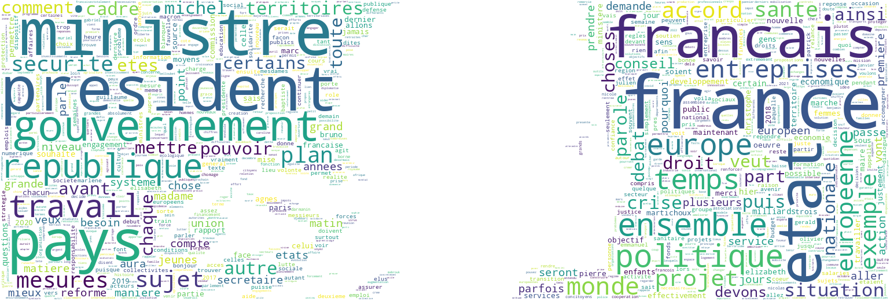
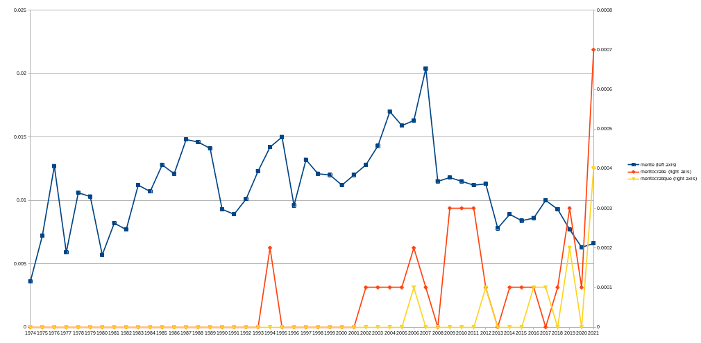

[![Contributors][contributors-shield]][contributors-url]
[![Forks][forks-shield]][forks-url]
[![Stargazers][stars-shield]][stars-url]
[![Issues][issues-shield]][issues-url]


<!-- PROJECT LOGO -->
<br />
<p align="center">
  <a href="../../">
    
  </a>

  <h3 align="center">french-politicians-speechs</h3>

  <p align="center">
    French politician speechs dataset (from 1984 to 2021, 107k speeches)
    <br />
  </p>
</p>


<!-- TABLE OF CONTENTS -->
<details open="open">
  <summary>Table of Contents</summary>
  <ol>
    <li><a href="#about-the-project">About The Project</a></li>
    <li><a href="#getting-started">Getting Started</a></li>
    <li><a href="#prerequisites">Prerequisites</a></li>
    <li><a href="#usage">Usage</a></li>
    <li><a href="#contributing">Contributing</a></li>
    <li><a href="#license">License</a></li>
    <li><a href="#contact">Contact</a></li>
  </ol>
</details>


<!-- ABOUT THE PROJECT -->
## About The Project



Looking for a way to analyze the evolution of the speeches of the French political class, we wanted to follow the frequency of use of certain words according to the years or the politician.

There are 107k speeches, with their source texts, their normalized texts (to facilitate keyword searches), their speakers, their keywords, and their publication date.

This project contains only the datasets and an example file of its use.
NLP is a very complicated field, but the idea is to be able to work on data with very little programming knowledge while allowing everyone to do powerful searches in all this data.

Based on an idea by <a href="https://twitter.com/Stupid_Eco">Arnaud - Stupid Economics</a>


<!-- GETTING STARTED -->
## Getting Started

git clone this project or [download this project](../../archive/refs/heads/master.zip)

### Prerequisites

You just need to have [python](https://www.python.org/downloads/) installed

## Format

> open data/speechs_normalized.rows_json.gz

```json
{
  "id": [ID],
  "url": "https://www.vie-publique.fr/discours/[ID]-[NAME]",
  "terms": [
    "[term]",
    "[term]",
    "[term]"
  ],
  "text_source": "Lorem Ipsum is simply dummy text of the printing and typesetting industry. Lorem Ipsum has been the industry's standard dummy text ever since the 1500s, when an unknown printer took a galley of type and scrambled it to make a type specimen book.",
  "text_normalized": "lorem ipsum is simply dummy text of the printing and typesetting industry lorem ipsum has been the industry s standard dummy text ever since the s when an unknown printer took a galley of type and scrambled it to make a type specimen book",
  "datetime": "1990-01-01T00:00:00Z",
  "speakers": [
    "[speaker_name]"
  ]
}
```

One speech by row, each row is a json string


<!-- USAGE EXAMPLES -->
## Usage

> python3 analyze_by_word.py

```csv
Word;Year;Percentage;Word_occurrence;Word_count

merite;1974;0.0036;3;82292
merite;1975;0.0072;10;138123
merite;1976;0.0127;23;181699
merite;1977;0.0059;13;219004
merite;1978;0.0106;21;198794
merite;1979;0.0103;35;340015
merite;1980;0.0057;19;331479
merite;1981;0.0082;58;707781
merite;1982;0.0077;40;517150
merite;1983;0.0112;55;491849
merite;1984;0.0107;47;439214
merite;1985;0.0128;53;414668
merite;1986;0.0121;42;348275
merite;1987;0.0148;73;492597
merite;1988;0.0146;85;582009
merite;1989;0.0141;70;495652
merite;1990;0.0093;47;506723
merite;1991;0.0089;34;383316
merite;1992;0.0101;38;377549
merite;1993;0.0123;50;405986
merite;1994;0.0142;77;541096
merite;1995;0.0150;73;485083
merite;1996;0.0096;49;511777
merite;1997;0.0132;115;870670
merite;1998;0.0121;225;1858737
merite;1999;0.0120;395;3281318
merite;2000;0.0112;340;3048208
merite;2001;0.0120;421;3514641
merite;2002;0.0128;427;3329678
merite;2003;0.0143;517;3604598
merite;2004;0.0170;611;3604113
merite;2005;0.0159;597;3744724
merite;2006;0.0163;606;3707431
merite;2007;0.0204;845;4146765
merite;2008;0.0115;427;3704067
merite;2009;0.0118;382;3224691
merite;2010;0.0115;236;2046594
merite;2011;0.0112;264;2356866
merite;2012;0.0113;267;2366552
merite;2013;0.0078;218;2783411
merite;2014;0.0089;228;2567185
merite;2015;0.0084;266;3177651
merite;2016;0.0086;298;3475113
merite;2017;0.0100;256;2548238
merite;2018;0.0093;317;3399793
merite;2019;0.0077;277;3585748
merite;2020;0.0063;208;3281682
merite;2021;0.0066;133;2004520

meritocratie;1974;0.0000;0;82292
meritocratie;1975;0.0000;0;138123
meritocratie;1976;0.0000;0;181699
meritocratie;1977;0.0000;0;219004
meritocratie;1978;0.0000;0;198794
meritocratie;1979;0.0000;0;340015
meritocratie;1980;0.0000;0;331479
meritocratie;1981;0.0000;0;707781
meritocratie;1982;0.0000;0;517150
meritocratie;1983;0.0000;0;491849
meritocratie;1984;0.0000;0;439214
meritocratie;1985;0.0000;0;414668
meritocratie;1986;0.0000;0;348275
meritocratie;1987;0.0000;0;492597
meritocratie;1988;0.0000;0;582009
meritocratie;1989;0.0000;0;495652
meritocratie;1990;0.0000;0;506723
meritocratie;1991;0.0000;0;383316
meritocratie;1992;0.0000;0;377549
meritocratie;1993;0.0000;0;405986
meritocratie;1994;0.0002;1;541096
meritocratie;1995;0.0000;0;485083
meritocratie;1996;0.0000;0;511777
meritocratie;1997;0.0000;0;870670
meritocratie;1998;0.0000;0;1858737
meritocratie;1999;0.0000;0;3281318
meritocratie;2000;0.0000;1;3048208
meritocratie;2001;0.0000;1;3514641
meritocratie;2002;0.0001;3;3329678
meritocratie;2003;0.0001;3;3604598
meritocratie;2004;0.0001;5;3604113
meritocratie;2005;0.0001;5;3744724
meritocratie;2006;0.0002;8;3707431
meritocratie;2007;0.0001;6;4146765
meritocratie;2008;0.0000;1;3704067
meritocratie;2009;0.0003;9;3224691
meritocratie;2010;0.0003;7;2046594
meritocratie;2011;0.0003;8;2356866
meritocratie;2012;0.0001;2;2366552
meritocratie;2013;0.0000;0;2783411
meritocratie;2014;0.0001;3;2567185
meritocratie;2015;0.0001;2;3177651
meritocratie;2016;0.0001;5;3475113
meritocratie;2017;0.0000;1;2548238
meritocratie;2018;0.0001;5;3399793
meritocratie;2019;0.0003;11;3585748
meritocratie;2020;0.0001;4;3281682
meritocratie;2021;0.0007;14;2004520

meritocratique;1974;0.0000;0;82292
meritocratique;1975;0.0000;0;138123
meritocratique;1976;0.0000;0;181699
meritocratique;1977;0.0000;0;219004
meritocratique;1978;0.0000;0;198794
meritocratique;1979;0.0000;0;340015
meritocratique;1980;0.0000;0;331479
meritocratique;1981;0.0000;0;707781
meritocratique;1982;0.0000;0;517150
meritocratique;1983;0.0000;0;491849
meritocratique;1984;0.0000;0;439214
meritocratique;1985;0.0000;0;414668
meritocratique;1986;0.0000;0;348275
meritocratique;1987;0.0000;0;492597
meritocratique;1988;0.0000;0;582009
meritocratique;1989;0.0000;0;495652
meritocratique;1990;0.0000;0;506723
meritocratique;1991;0.0000;0;383316
meritocratique;1992;0.0000;0;377549
meritocratique;1993;0.0000;0;405986
meritocratique;1994;0.0000;0;541096
meritocratique;1995;0.0000;0;485083
meritocratique;1996;0.0000;0;511777
meritocratique;1997;0.0000;0;870670
meritocratique;1998;0.0000;0;1858737
meritocratique;1999;0.0000;0;3281318
meritocratique;2000;0.0000;0;3048208
meritocratique;2001;0.0000;0;3514641
meritocratique;2002;0.0000;1;3329678
meritocratique;2003;0.0000;0;3604598
meritocratique;2004;0.0000;0;3604113
meritocratique;2005;0.0000;0;3744724
meritocratique;2006;0.0001;2;3707431
meritocratique;2007;0.0000;1;4146765
meritocratique;2008;0.0000;1;3704067
meritocratique;2009;0.0000;1;3224691
meritocratique;2010;0.0000;1;2046594
meritocratique;2011;0.0000;0;2356866
meritocratique;2012;0.0001;2;2366552
meritocratique;2013;0.0000;0;2783411
meritocratique;2014;0.0000;1;2567185
meritocratique;2015;0.0000;0;3177651
meritocratique;2016;0.0001;2;3475113
meritocratique;2017;0.0001;3;2548238
meritocratique;2018;0.0000;1;3399793
meritocratique;2019;0.0002;6;3585748
meritocratique;2020;0.0000;1;3281682
meritocratique;2021;0.0004;8;2004520
```




<!-- CONTRIBUTING -->
## Contributing

Contributions are what make the open source community such an amazing place to be learn, inspire, and create. Any contributions you make are **greatly appreciated**.

1. Fork the Project
2. Create your Feature Branch (`git checkout -b feature/AmazingFeature`)
3. Commit your Changes (`git commit -m 'Add some AmazingFeature'`)
4. Push to the Branch (`git push origin feature/AmazingFeature`)
5. Open a Pull Request


<!-- LICENSE -->
## License

* (code) [MIT](https://opensource.org/licenses/MIT)
* (data) [https://vie-publique.fr/discours](https://vie-publique.fr/discours)
* (icon) [itim2101](https://www.flaticon.com/fr/auteurs/itim2101)


<!-- CONTACT -->
## Contact

Nargor - nargor_contact@protonmail.com (tech)

Arnaud - [@Stupid_Eco](https://twitter.com/Stupid_Eco) - contact@stupmedia.com (journalist)


<!-- MARKDOWN LINKS & IMAGES -->
<!-- https://www.markdownguide.org/basic-syntax/#reference-style-links -->
[contributors-shield]: https://img.shields.io/github/contributors/Nargor/french-politicians-speechs.svg?style=for-the-badge
[contributors-url]: https://github.com/Nargor/french-politicians-speechs/graphs/contributors
[forks-shield]: https://img.shields.io/github/forks/Nargor/french-politicians-speechs.svg?style=for-the-badge
[forks-url]: https://github.com/Nargor/french-politicians-speechs/network/members
[stars-shield]: https://img.shields.io/github/stars/Nargor/french-politicians-speechs.svg?style=for-the-badge
[stars-url]: https://github.com/Nargor/french-politicians-speechs/stargazers
[issues-shield]: https://img.shields.io/github/issues/Nargor/french-politicians-speechs.svg?style=for-the-badge
[issues-url]: https://github.com/Nargor/french-politicians-speechs/issues
[license-shield]: https://img.shields.io/github/license/Nargor/french-politicians-speechs.svg?style=for-the-badge
[license-url]: https://github.com/Nargor/french-politicians-speechs/blob/master/LICENSE.txt
